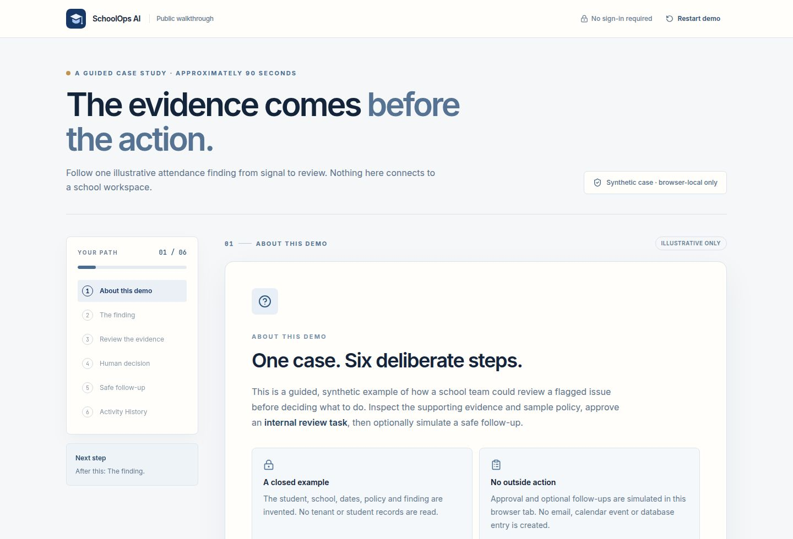

# SchoolOps AI

**Evidence before action for school operations.** School staff often have to piece together attendance signals, student context, policies, and follow-up work across separate systems. SchoolOps AI is a portfolio prototype of a single, reviewable workspace: it surfaces a finding, shows the supporting facts, proposes a next step, and keeps a person in control of the decision.

> **Project status:** Working prototype with synthetic school data. The public walkthrough is a closed, browser-local simulation. This is not a production student-information system or a substitute for school policy, professional judgment, or authorization to handle student records.



For a concise, recruiter-friendly overview, see the [portfolio case study](docs/case-study.md), or open `/case-study` in the running app.

## What it does

| Area | Implemented behavior |
| --- | --- |
| Public Demo Mode | A no-account, six-step attendance case: finding → evidence and invented policy → recommended internal review → human approval → optional simulated Gmail/Calendar follow-up → demo-only Activity History. Progress is kept in the current browser tab and can be restarted. Nothing is sent or written to a school workspace. |
| School workspace | Clerk sign-in, onboarding, school membership and role checks, school switching, student directory and detail views, communications, settings, integrations, and activity history. Operational records are scoped to the selected school. |
| Ask SchoolOps | An explainable operations assistant that uses active-school facts and, when relevant, policy excerpts/citations to answer questions about attendance, missing documents, tuition/payment plans, admissions, and student attention. Responses separate observed evidence from suggestions; a missing policy match is not presented as an authoritative citation. The current pipeline is deterministic application logic, not a claim that an autonomous model or live SIS powers the demo. |
| Human review | Proposed actions have explicit approval/rejection states. External Gmail/Calendar actions in the authenticated synthetic test flow require an approved, persisted proposal and are constrained to safe demo content. |
| Knowledge and history | Synthetic seeded policy guidance plus user-managed text/Markdown documents; recorded agent runs and decisions in the authenticated workspace. The public demo's Activity History is **separate and browser-local**. |

### Smartcare and connector disclaimer

**Smartcare is represented only by a synthetic Demo Connector and illustrative field mapping. There is no live Smartcare connection, data import, or official Smartcare API access in this repository.** A real integration would require official API access, permission to use it, an authorized school account, data agreements, and a separately implemented and tested adapter. Do not upload real care, student, family, or school records to this demo.

Gmail and Google Calendar are different: authenticated demo-safe operations use the Replit Connectors SDK if the workspace owner has authorized the integrations. The existing connections are a **shared test setup for the original synthetic demo school**, not a per-school OAuth integration. Other schools must not be treated as connected. In the public `/demo` walkthrough, both follow-up choices are simulated only; no connector is called.

## Architecture at a glance

```text
Browser
  ├─ Public /demo → synthetic case + sessionStorage only
  └─ Authenticated React app → generated React Query API client
                                │
                                ▼
                        /api (Express + Clerk)
                                │
                  school membership / active-school context
                         ┌──────┴─────────┐
                         ▼                ▼
               PostgreSQL + Drizzle   Approved, scoped actions
               operations, policies   → optional Replit Connectors
               runs, action history      → Gmail / Google Calendar
```

- `artifacts/schoolops-ai/`: React 19, Vite, TypeScript, Tailwind CSS, Wouter, React Query, Clerk UI. The public route is deliberately independent of tenant records.
- `artifacts/api-server/`: Express 5, Clerk middleware, school-scoped routes, approval and external-action gates.
- `lib/db/`: PostgreSQL schema and Drizzle access. School operations and history live here, not in the public demo's browser storage.
- `lib/api-spec/`, `lib/api-zod/`, `lib/api-client-react/`: OpenAPI contract, generated Zod types, and generated client hooks. Regenerate after contract changes.
- `artifacts/mockup-sandbox/`: **design-only component preview workspace**, not a production service or a second SchoolOps product.

The application uses integration-shaped inputs that normalize synthetic operational records into school context before evaluation. The Smartcare-shaped mapping illustrates this boundary; it is **not** a working vendor adapter. The `/api` service and the web app share the Replit path router; `/api/__clerk` is the auth proxy. Authenticated school routes require membership; public `/demo` makes no school API calls.

### Tenant and decision boundaries

- Clerk identifies the signed-in user; the API resolves that user's membership in the **active school** before accessing school operations, policies, history, or connectors. School switching is restricted to the user's memberships. Admin-only management actions and external side effects have additional role checks. The public walkthrough never chooses an active school.
- Ask SchoolOps grounds answers in the active school's synthetic operational facts and matched policy sections. Citations refer to the retrieved example text; if no matching policy is available, a general suggestion is **not** represented as policy authority.
- Approval is separate from execution. A stored, approved proposal is checked again on the server before a demo-safe Gmail or Calendar action. Public-demo approval is local state only and cannot authorize an API side effect. These are safeguards in a prototype, not a certification for handling real student records.

### Repository map

| Path | Purpose |
| --- | --- |
| `artifacts/schoolops-ai/` | Web app and the public, browser-local walkthrough |
| `artifacts/api-server/` | School-scoped API, authentication, history, policies, and gated test connectors |
| `lib/db/` | PostgreSQL/Drizzle models and data access |
| `lib/api-spec/`, `lib/api-zod/`, `lib/api-client-react/` | OpenAPI contract and generated validation/client code |
| `artifacts/mockup-sandbox/` | Design preview workspace, not a SchoolOps production service |
| `docs/screenshots/` | Synthetic public-demo screenshot for this README |

## End-to-end reviewer workflow

1. **Observe:** An attendance pattern is flagged from synthetic operations data. The app does not infer a cause from the count alone.
2. **Ground:** Inspect the underlying entries and the relevant *invented* policy excerpt/ID. Ask SchoolOps can present supporting school facts and applicable policy citations instead of only a conclusion.
3. **Recommend:** Propose an internal review of the attendance record and context; no outbound contact is implied.
4. **Decide:** A person approves or rejects the proposed action. In the authenticated workflow, that decision and the action state are persisted under the active school; authorization is checked again before external work.
5. **Act, optionally:** For the authenticated synthetic test school only, a separately approved proposal can trigger a constrained self-addressed Gmail test message or attendee-free Calendar event through an authorized connector. This is **not** the public demo: its email/calendar options record only simulated results in browser storage.
6. **Trace:** The authenticated workspace records runs and action history; the public demo displays a clearly labeled, local-only history entry. Neither should be confused with evidence that a real student was contacted.

## Try the demo

Open the running app and select **Try Demo** on the welcome or sign-in screen, or visit `/demo` directly. No account or Gmail/Calendar connection is required. Advance through the finding, evidence, policy, and approval, then choose a simulated follow-up (or skip it). The last step shows the demo Activity History. Reloading the same tab preserves progress; **Restart demo** clears it.

To inspect the authenticated workspace instead, sign in, join or create a school, and use the school switcher when you have multiple memberships. The example schools and seeded records are synthetic. Public-demo approval never creates an authenticated task.

## Setup and run

This is a **pnpm monorepo designed for a Replit workspace** with managed artifact workflows and path routing. A standalone local clone needs its own PostgreSQL, Clerk setup, and compatible reverse proxy for `/api`, `/api/__clerk`, and the web app; running only Vite is not a full-stack setup.

1. Use Node.js 24 and pnpm. Install with `pnpm install --frozen-lockfile`.
2. Provision a PostgreSQL database and a Clerk tenant. In Replit, use the database and managed Clerk/Auth setup. Add required credentials through **Replit Secrets**, never a committed file. [`.env.example`](.env.example) contains deliberately unusable placeholder values; replace them only in your environment, not in Git. The publishable key is public configuration, but the secret key and database URL are not.
3. For a new **development** database only, run `pnpm --filter @workspace/db run push`. Do not point this command at production or an existing database without reviewing the migration impact.
4. Start the managed **API Server** (`artifacts/api-server: API Server`) and **web** (`artifacts/schoolops-ai: web`) workflows in Replit. They supply their own `PORT` and web `BASE_PATH`; do not run `pnpm dev` from the repository root. Open the web preview at `/`, and `/demo` for the guest walkthrough.
5. Check the project with `pnpm run typecheck` and `pnpm --filter @workspace/schoolops-ai run test`. To rebuild the API contract clients after changing `lib/api-spec/`, run `pnpm --filter @workspace/api-spec run codegen`.

### Configuration and integrations

| Setting / integration | Need | Notes |
| --- | --- | --- |
| `DATABASE_URL` | Authenticated workspace | PostgreSQL; runtime-managed by Replit database in this environment. Keep it secret. |
| `CLERK_SECRET_KEY`, `CLERK_PUBLISHABLE_KEY`, `VITE_CLERK_PUBLISHABLE_KEY` | Authenticated workspace | Clerk server/auth proxy and browser key. In this Replit workspace, Clerk is managed; use the supplied development/production configuration rather than copying keys into Git. |
| `VITE_CLERK_PROXY_URL` | Deployment-dependent | Optional browser proxy URL if your Clerk setup uses the `/api/__clerk` proxy; configure for your own host. |
| `PORT`, `BASE_PATH` | Web/API runtime | Supplied by artifact workflows. Web Vite requires both when started manually; API binds to `PORT`. |
| Gmail, Google Calendar | **Optional** authenticated synthetic test actions | Authorize through Replit integrations for the designated test school only. No Gmail OAuth client secrets, refresh tokens, or Google credentials belong in this repo or `.env.example`. `/demo` works without them. |
| Smartcare | **Not available** | Demo-only synthetic mapping. Requires official API access and a new integration project before any live connection can be claimed. |

## Data and sharing boundaries

- Sample school/student names, attendance entries, policy text, and seeded history narratives are invented. `artifacts/api-server/src/lib/synthetic-schools.ts` and demo policy/history seeds are examples, **not real SIS exports, legal/medical guidance, or verified outcome statistics**. The public walkthrough lives in `artifacts/schoolops-ai/src/pages/demo.tsx` and stores its state in `sessionStorage`, not the school database.
- `artifacts/mockup-sandbox/` and `.agents/memory/` are workspace/design and agent-maintenance materials, **not product features or deployment instructions**. `replit.md` is collaborator guidance; this README is the public-facing source of truth.
- `.env*` (except `.env.example`), credentials, key material, local databases, and generated outputs are ignored. No real OAuth credentials or student data should be added. **Before publishing a fork, review the full Git history as well as the current files**; ignore rules cannot remove secrets that were committed previously.

## Roadmap

1. School-owned Gmail and Calendar authorization rather than the current shared demo setup.
2. Additional automated isolation and answer-grounding regression checks across signed-in schools.
3. An official Smartcare adapter **only if** API access, authorization, and appropriate data-handling agreements become available.
4. Broader document-ingestion and connector coverage after those trust boundaries are established.

These are planned directions, not shipped integrations or claims of production readiness.

## Licensing

No license has been selected for this project's original code. Public visibility alone does not grant permission to reuse it. Dependencies and generated components retain their own respective licenses; review those separately before redistribution.